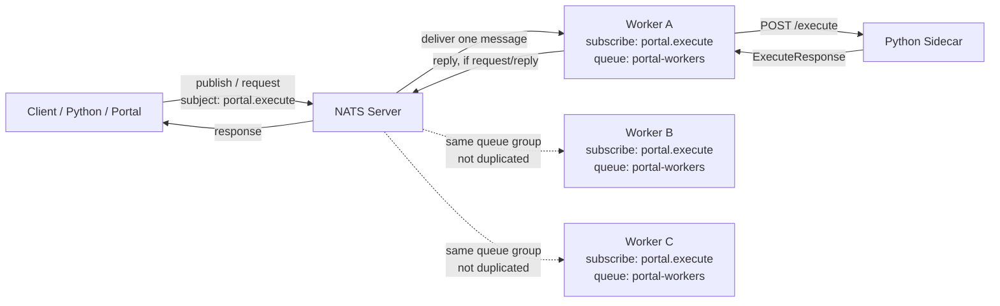
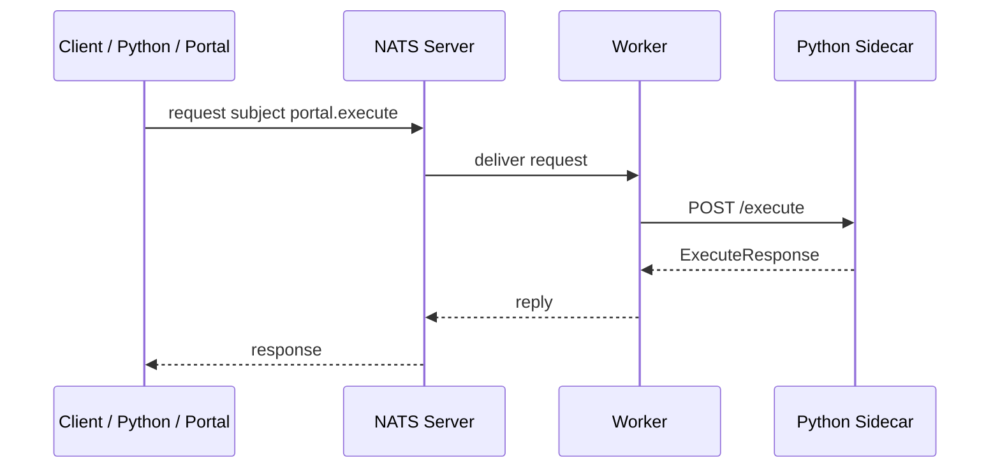

# NATS Architecture

This project uses NATS to send execution requests from a producer to one worker instance through a subject.



## Routing

Producers only send to a subject:

```text
subject = portal.execute
```

Workers subscribe to the same subject with a queue group:

```text
subject = portal.execute
queue   = portal-workers
```

NATS delivers each message to only one subscriber inside the same queue group. This allows multiple worker instances to share load without processing the same request more than once.

## Request/Reply Flow


