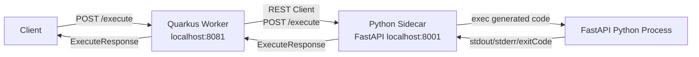
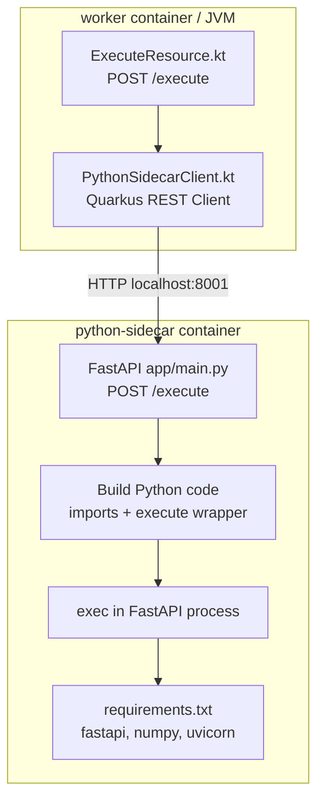
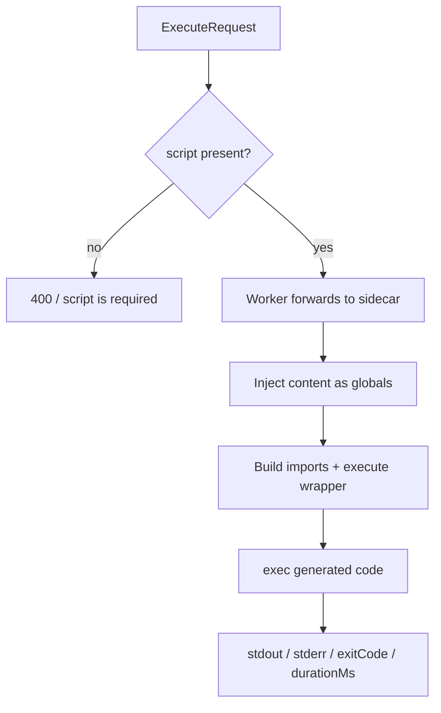

# System Architecture

## High-Level Flow



## Runtime Boundary



## Execute Request



Request:

```json
{
  "script": "print(CurrentContent[\"Worker\"])",
  "content": {
    "CurrentContent": {"Worker": "Start"}
  }
}
```

Generated Python shape. The request `script` is inserted at `<script>`:

```python
import json
import numpy as np

def execute():
    <script>

__result__ = execute()
```

## Current Limits

The Python sidecar is the risky runtime boundary. The current implementation executes script directly in the FastAPI process.

Current behavior:

- No subprocess boundary.
- No subprocess timeout.
- No AST validation.
- No import allowlist.
- `json` and `numpy` are imported automatically.
- `content` top-level keys become Python globals.
- stdout and stderr are limited before being returned.

Recommended Docker Compose settings still matter if this is used outside local development:

```yaml
services:
  python-sidecar:
    mem_limit: 256m
    cpus: "0.5"
    pids_limit: 64
    read_only: true
    tmpfs:
      - /tmp
    security_opt:
      - no-new-privileges:true
    cap_drop:
      - ALL
```

## Important Note

This is not a secure Python sandbox.

If scripts are untrusted, long-running, or allowed to perform expensive work, add an isolation boundary such as a subprocess, worker process, container job, timeout, or queue before production use.
