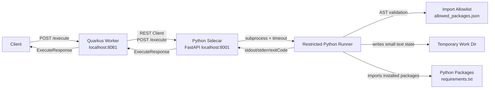
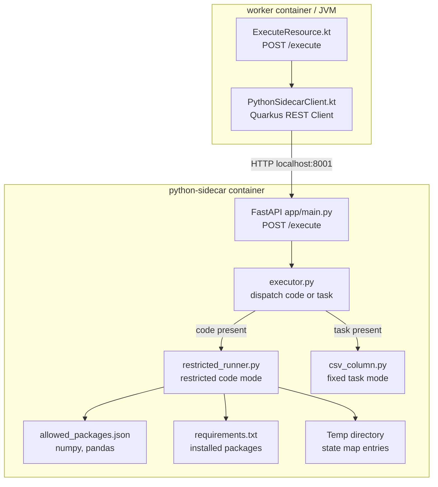
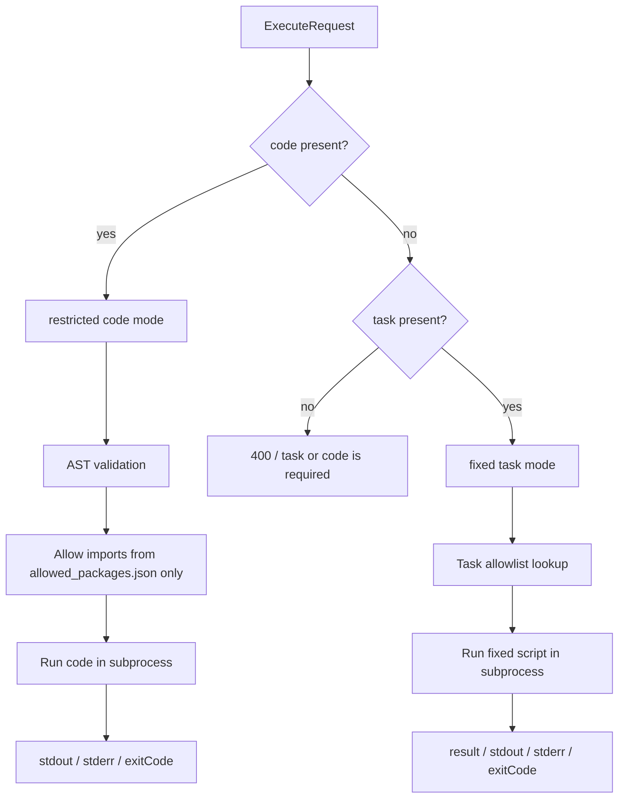
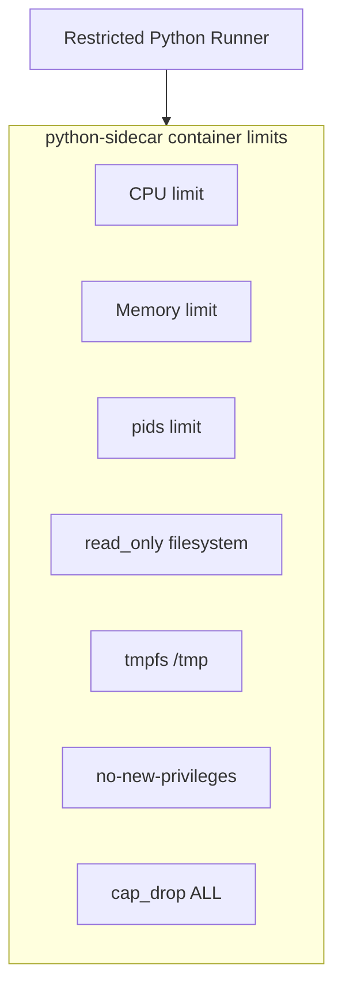

# System Architecture

## High-Level Flow



## Runtime Boundary



## Execute Request Modes



## State Map

`state` is a small text map sent with code execution:

```json
{
  "code": "import numpy as np\nprint(np.loadtxt(\"numbers.csv\", delimiter=\",\").mean())",
  "state": {
    "numbers.csv": "1,2,3\n4,5,6\n"
  }
}
```

The runner writes each `state` entry into a temporary working directory before executing code.

Use `state` only for small text values. For large files or binary data, use a mounted volume, object storage, or multipart upload.

## Container Limits

The Python sidecar is the risky runtime boundary. CPU, memory, pids, filesystem, and privilege limits should be applied to the sidecar container.



Recommended Docker Compose settings:

```yaml
services:
  python-sidecar:
    mem_limit: 256m
    cpus: "0.5"
    pids_limit: 64
    read_only: true
    tmpfs:
      - /tmp
    security_opt:
      - no-new-privileges:true
    cap_drop:
      - ALL
```

## Important Note

This design is a restricted Python runner, not a complete secure sandbox.

The stronger isolation boundary should come from container or OS-level restrictions. AST checks and import allowlists are useful filters, but they should not be treated as the only security control.
